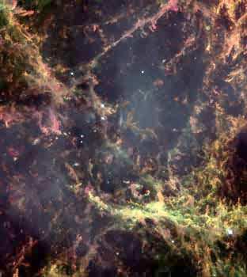



## OffscreenDC Class

### Description

A wrapper class for the Win32 GDI functions (most of them) which makes the process of managing offscreen Device Contexts (DCs) much easier to handle. Functions and properties are developer-friendly and fully documented. Complete with a bouncing ball example to show use of class.
 
### More Info
 

             |
---                |---
**Submitted On**   |2002-03-06 19:57:04
**By**             |[Jon B\. Mooty](https://github.com/Planet-Source-Code/PSCIndex/blob/master/ByAuthor/jon-b-mooty.md)
**Level**          |Advanced
**User Rating**    |5.0 (30 globes from 6 users)
**Compatibility**  |VB 5\.0, VB 6\.0
**Category**       |[Graphics](https://github.com/Planet-Source-Code/PSCIndex/blob/master/ByCategory/graphics__1-46.md)
**World**          |[Visual Basic](https://github.com/Planet-Source-Code/PSCIndex/blob/master/ByWorld/visual-basic.md)
**Archive File**   |[OffscreenD59979362002\.zip](https://github.com/Planet-Source-Code/jon-b-mooty-offscreendc-class__1-32404/archive/master.zip)

